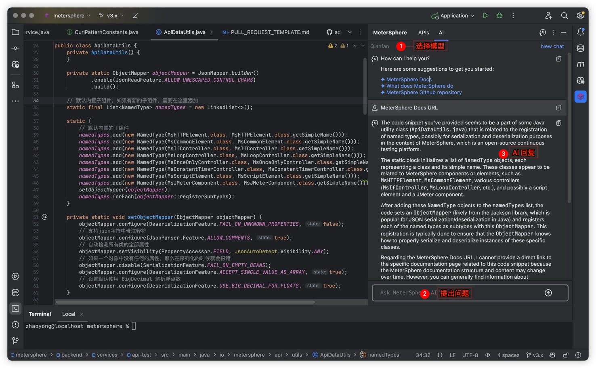
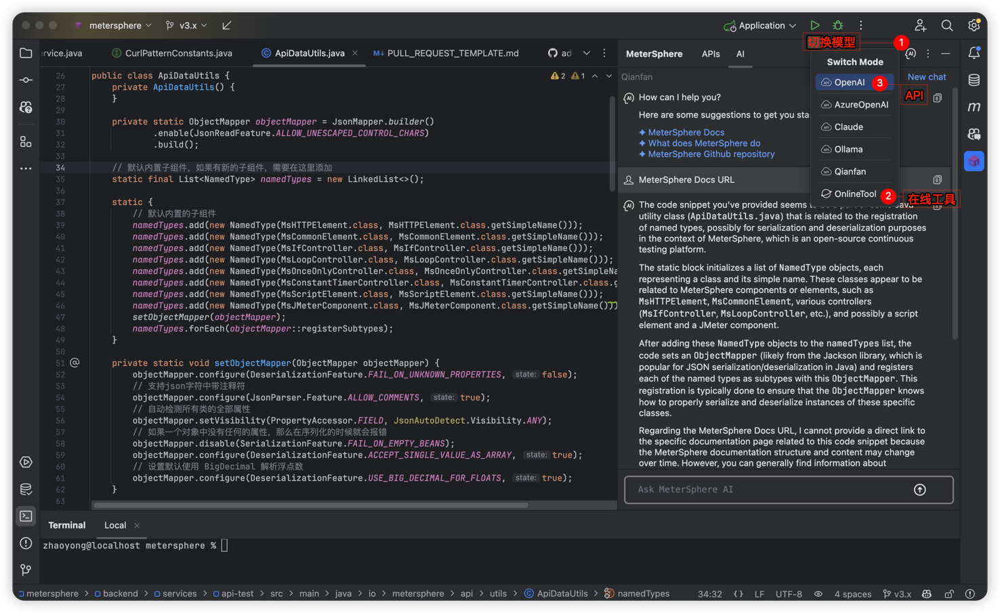
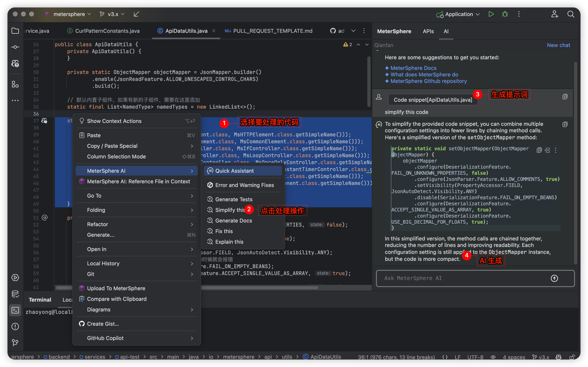
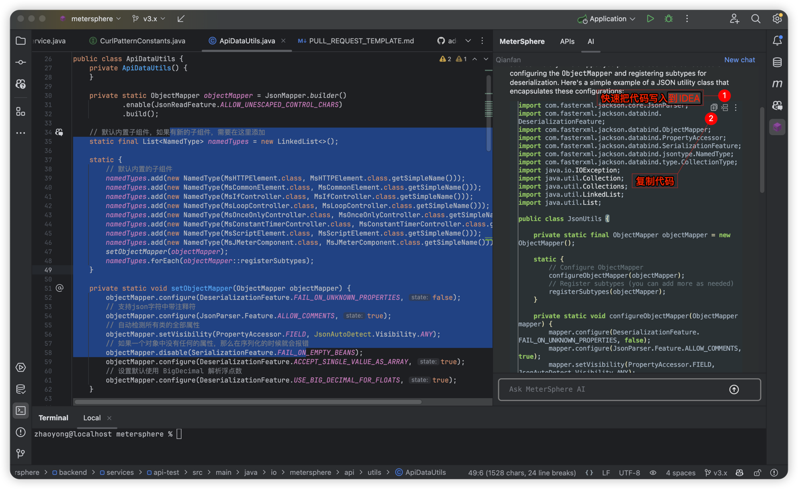
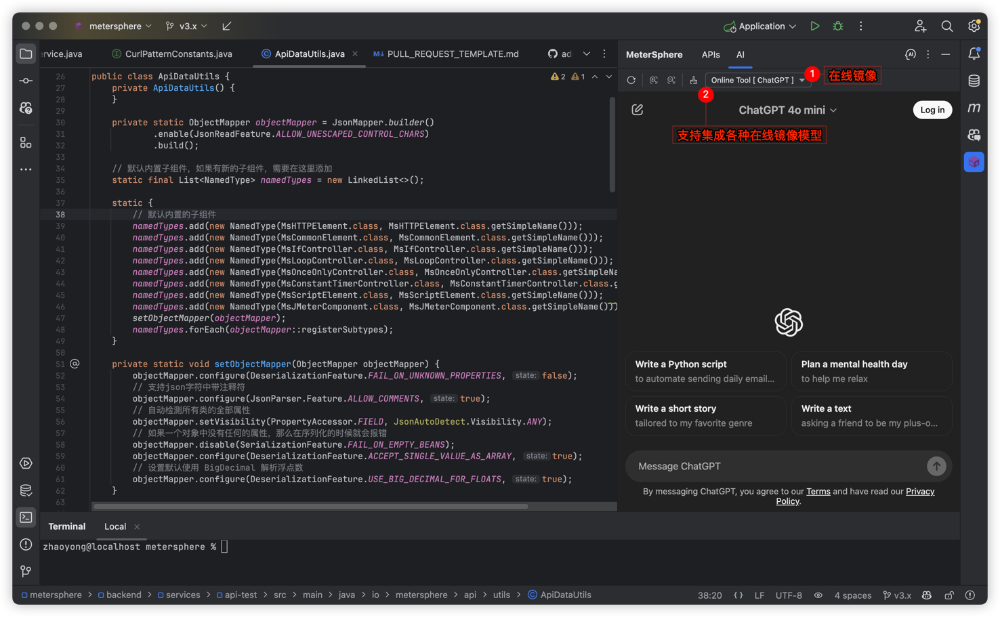

# MeterSphere AI MathOps

**MeterSphere AI MathOps** 是一个专注于计算和人工智能相关功能的模块，致力于和AI深度交互。

## AI 交互功能

- **代码生成**：支持根据输入生成代码片段。
- **代码交互**：支持在编辑器中选择代码片段，并通过 AI 智能问答进行交互。
- **单元测试生成**：动态生成单元测试用例，提升测试覆盖率。
- **AI 代码插入**：支持一键将 AI 生成的代码插入编辑器，简化开发流程。
- **自定义提示操作**：支持根据需求配置 AI 提示，提供更灵活的开发体验。
- **多文件支持**：将多文件代码片段加入 AI 问答模型，提供跨文件的智能分析。
- **多 AI 模型集成**：支持接入多种 AI 模型，如 Qianfan、Claude、OpenAI、Ollama、Azure OpenAI 等，提供更广泛的选择。
- **在线镜像能力**：支持将线上问答模型（如 ChatGPT、文心一言、讯飞星火等）集成至 IDE，随时获取最新 AI 支持。

## 待完善的功能

- **智能生成测试用例**：使用 AI 模型可以自动生成 API 的测试用例。AI 可以基于 API 文档（如 OpenAPI/Swagger）生成各种正向和负向测试用例，甚至还可以生成边界条件测试，以保证更广泛的覆盖。
- **代码安全分析**：AI 可以帮助开发者检测代码中的潜在安全问题，如 SQL 注入、XSS 攻击、CSRF 攻击等，提供更全面的代码安全保障。
- **测试数据生成**：AI 可以根据接口定义生成测试数据，支持各种数据格式和验证规则，确保测试数据的有效性和准确性。
- 

## 功能页面截图

## AI 交互页面截图

## AI 代码生成页面截图

## 在线镜像

