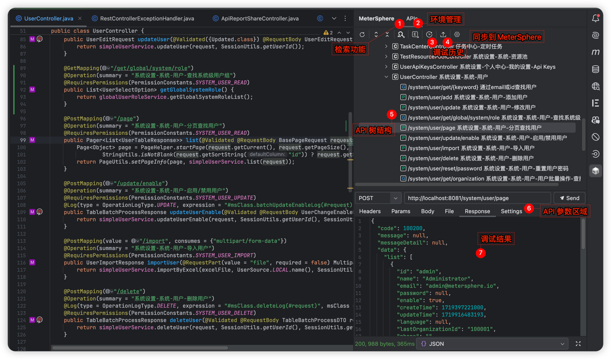

# MeterSphere API Debugger

MeterSphere API Debugger 是一个用于调试和测试 API 的插件，专注于提供 API 调试和测试相关的功能。

## 特性

- **API 请求调试支持**：提供完整的 API 调试功能，支持发送请求并进行实时调试。

- **自动生成 URL 和请求参数**：自动构建 API 请求的 URL 和参数，简化接口调用流程。

- **动态域名捕获与自定义切换**：自动捕获并生成域名，支持在不同环境之间的动态切换，提升测试灵活性。

- **自定义参数解析功能**：允许用户自定义解析 API 请求参数，以适应不同的业务需求和数据格式。

- **API 导航树支持**：构建和展示 API 导航树，直观地展示接口层级结构，帮助用户快速定位和浏览接口。

- **SearchEveryWhere 搜索功能**：集成 SearchEveryWhere 搜索功能，支持高效检索 API 接口，提升开发和测试效率。

- **修改生成参数的调试支持**：支持在发送请求时修改自动生成的参数，方便调试和验证接口的不同场景。

- **动态 Mock 数据生成**：根据接口规范动态生成 Mock 数据，快速模拟真实环境中的接口响应，支持高效调试。

- **API 管理功能**：提供 API 的管理功能，包括搜索、过滤和修改接口名称，以便于组织和维护 API 文档。

- **调试历史回溯与二次调试**：支持从调试历史记录中一键定位到相应 API，并进行后续的二次调试，确保问题的有效解决。

- **基于接口规范的动态请求数据生成**：根据接口定义的规范自动生成请求数据，确保生成的数据与接口要求相符，支持多种数据格式和验证规则。

## 功能页面截图

## 调试页面截图

## 环境页面截图

## 执行历史页面截图

## 系统设置页面截图

## 同步页面截图

## 同步后平台展示效果

## 功能演示视频

